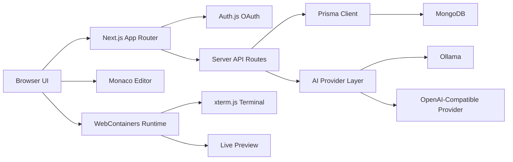

# Forge Editor

[](https://github.com/Rajtiwari0202/ai-code-editor/actions/workflows/ci.yml)
[](https://github.com/Rajtiwari0202/ai-code-editor/actions/workflows/codeql.yml)

Forge Editor is a browser-based AI code editor for creating projects, editing files, running templates, previewing apps, and reviewing AI suggestions from one focused workspace.

[Live Demo](https://aicodeeditor-sand.vercel.app) | [Architecture](./docs/ARCHITECTURE.md) | [Deployment](./docs/DEPLOYMENT.md) | [Project Profile](./docs/PROJECT_PROFILE.md)


## Why It Exists

Modern AI coding tools are powerful, but they often hide too much of the work. Forge Editor is built around a different product idea: keep the developer in control. AI can help plan, explain, review, and suggest code, while the editor keeps files, terminal output, previews, and project state visible.

The result is a full-stack web IDE foundation with authentication, persisted playgrounds, starter templates, Monaco editing, WebContainers, terminal execution, live preview, and provider-backed AI assistance.

## Screenshots

| Public product page | OAuth sign-in |
| --- | --- |
|  |  |

| Workspace preview |
| --- |
|  |

## Product Highlights

- Google and GitHub OAuth authentication through Auth.js/NextAuth.
- Dashboard for creating, opening, starring, duplicating, renaming, and deleting playgrounds.
- Template-driven project creation for React, Next.js, Express, Hono, Vue, and Angular.
- Monaco editor with tabs, syntax-aware editing, inline AI completion hooks, and file tree actions.
- Browser-contained runtime through WebContainers, with terminal and preview panels.
- AI chat sidebar for project-aware coding help, review, fix, and optimization prompts.
- Provider abstraction for local Ollama and hosted OpenAI-compatible chat-completions APIs.
- Prisma + MongoDB persistence for users, OAuth accounts, playgrounds, saved files, and chat records.
- Release gates for environment validation, docs validation, template validation, dependency audit, lint, build, smoke tests, CI, Dependabot, and CodeQL.

## Architecture



Forge Editor separates browser-only runtime work from server-owned secrets. OAuth credentials, database URLs, and AI provider keys stay server-side. WebContainers execute inside the browser, while persisted playground state is scoped to the authenticated user before reads or writes reach Prisma.

## Tech Stack

| Layer | Technology |
| --- | --- |
| Framework | Next.js App Router |
| Language | TypeScript |
| UI | Tailwind CSS, Radix UI, shadcn-style primitives |
| Auth | Auth.js / NextAuth with Google and GitHub OAuth |
| Database | Prisma with MongoDB |
| Editor | Monaco Editor |
| Runtime | WebContainers |
| Terminal | xterm.js |
| AI | Ollama and OpenAI-compatible server routes |
| Validation | Zod, custom env/template/docs checks |
| Delivery | Vercel, GitHub Actions, Dependabot, CodeQL |

## Project Structure

```text
app/
  (auth)/                  Sign-in route group
  (root)/                  Public home, terms, privacy
  api/                     Auth, chat, completion, template, plan, patch, verify, health
  dashboard/               Authenticated playground dashboard
  playground/[id]/         Browser IDE route
components/
  providers/               Theme, auth, toast, query, and app providers
  ui/                      Shared UI primitives
docs/                      Architecture, deployment, operations, release, profile docs
lib/
  ai/                      Provider abstraction, contracts, planning, patch helpers
  verification/            Verification command allowlist
  workspace/               Local agent capability contract
  db.ts                    Prisma client
  site-url.ts              Production-safe URL helpers
  template.ts              Starter template registry
modules/
  ai-chat/                 Assistant side panel
  auth/                    Sign-in and user controls
  dashboard/               Dashboard actions and UI
  home/                    Public product sections
  playground/              Editor, explorer, tabs, hooks, dialogs
  webcontainers/           Runtime, terminal, preview orchestration
prisma/
  schema.prisma            MongoDB data model
templates/
  forge-starters/          Runnable starter projects
```

## Getting Started

Use Node.js 20 or newer and npm 10 or newer.

```bash
git clone https://github.com/Rajtiwari0202/ai-code-editor.git
cd ai-code-editor
npm install
cp .env.example .env.local
```

Fill the required environment variables:

```env
DATABASE_URL=
NEXTAUTH_URL=http://localhost:3000
NEXT_PUBLIC_SITE_URL=http://localhost:3000

AUTH_SECRET=
AUTH_GITHUB_ID=
AUTH_GITHUB_SECRET=
AUTH_GOOGLE_ID=
AUTH_GOOGLE_SECRET=
```

Run the development server:

```bash
npm run dev
```

Open [http://localhost:3000](http://localhost:3000).

## AI Provider Setup

Forge Editor supports two AI modes.

For local development with Ollama:

```bash
ollama pull codellama:latest
ollama serve
```

```env
AI_PROVIDER=ollama
OLLAMA_BASE_URL=http://127.0.0.1:11434
OLLAMA_MODEL=codellama:latest
```

For hosted production AI, use any OpenAI-compatible chat-completions provider:

```env
AI_PROVIDER=openai-compatible
OPENAI_API_KEY=
OPENAI_BASE_URL=
OPENAI_MODEL=
```

Provider keys must stay server-side. Do not expose them through `NEXT_PUBLIC_*`.

## Scripts

| Command | Purpose |
| --- | --- |
| `npm run dev` | Start the local development server |
| `npm run lint` | Run ESLint |
| `npm run build` | Build the production app |
| `npm run start` | Start the production server |
| `npm run validate:env` | Validate required environment variables |
| `npm run validate:env:strict` | Validate production-shaped environment values |
| `npm run validate:docs` | Validate local documentation links |
| `npm run validate:templates` | Validate starter template contracts |
| `npm run audit:prod` | Fail on high/critical production dependency advisories |
| `npm run smoke:prod` | Smoke test the built production server |
| `npm run verify:release` | Run the full release gate |

## Deployment

The live deployment runs on Vercel:

[https://aicodeeditor-sand.vercel.app](https://aicodeeditor-sand.vercel.app)

Production requires:

- `DATABASE_URL` for MongoDB.
- `AUTH_SECRET` with a stable random value.
- `NEXTAUTH_URL` and `NEXT_PUBLIC_SITE_URL` set to the production origin.
- GitHub OAuth callback: `/api/auth/callback/github`.
- Google OAuth callback: `/api/auth/callback/google`.
- An intentional AI provider posture, either local-model documentation or hosted OpenAI-compatible credentials.

Read [Deployment](./docs/DEPLOYMENT.md), [Release Checklist](./docs/RELEASE_CHECKLIST.md), and [Operations Runbook](./docs/OPERATIONS.md) before a production release.

## Documentation

- [Architecture](./docs/ARCHITECTURE.md)
- [AI Workflows](./docs/AI_WORKFLOWS.md)
- [Templates](./docs/TEMPLATES.md)
- [Deployment](./docs/DEPLOYMENT.md)
- [Operations Runbook](./docs/OPERATIONS.md)
- [Release Checklist](./docs/RELEASE_CHECKLIST.md)
- [Product Plan](./docs/PRODUCT_PLAN.md)
- [Project Profile](./docs/PROJECT_PROFILE.md)
- [Contributing](./docs/CONTRIBUTING.md)
- [Security Policy](./SECURITY.md)

## Project Status

Forge Editor is deployed with working OAuth, database-backed playground ownership, public legal pages, production health checks, WebContainer-ready isolation headers, CI release gates, dependency automation, and security scanning. The AI layer is provider-configurable: Ollama is best for local development, while hosted OpenAI-compatible providers are best for Vercel production.

Remaining product growth areas:

- Streaming AI responses.
- Richer prompt templates and model selection.
- Reviewable diff application from AI patch proposals.
- Verification command execution from the existing allowlisted contract.
- More authenticated production screenshots for portfolio use.

## License

No open-source license has been selected yet. Choose and add a license file before broad public redistribution.
