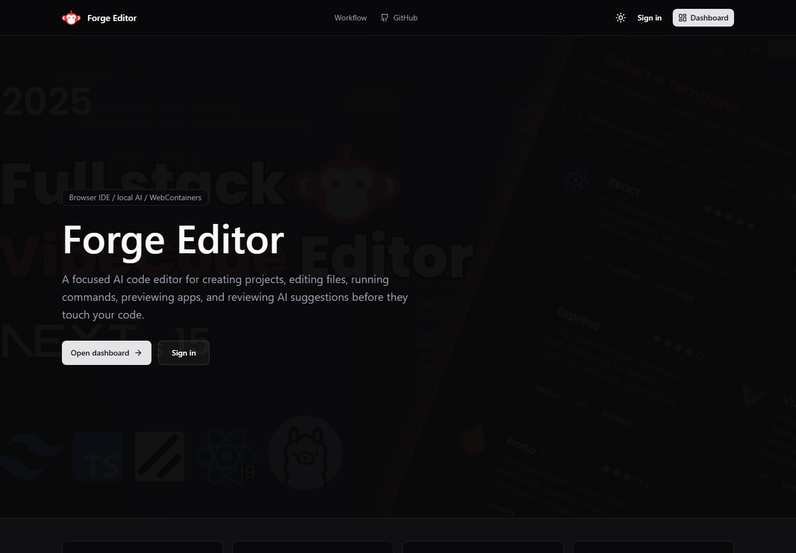
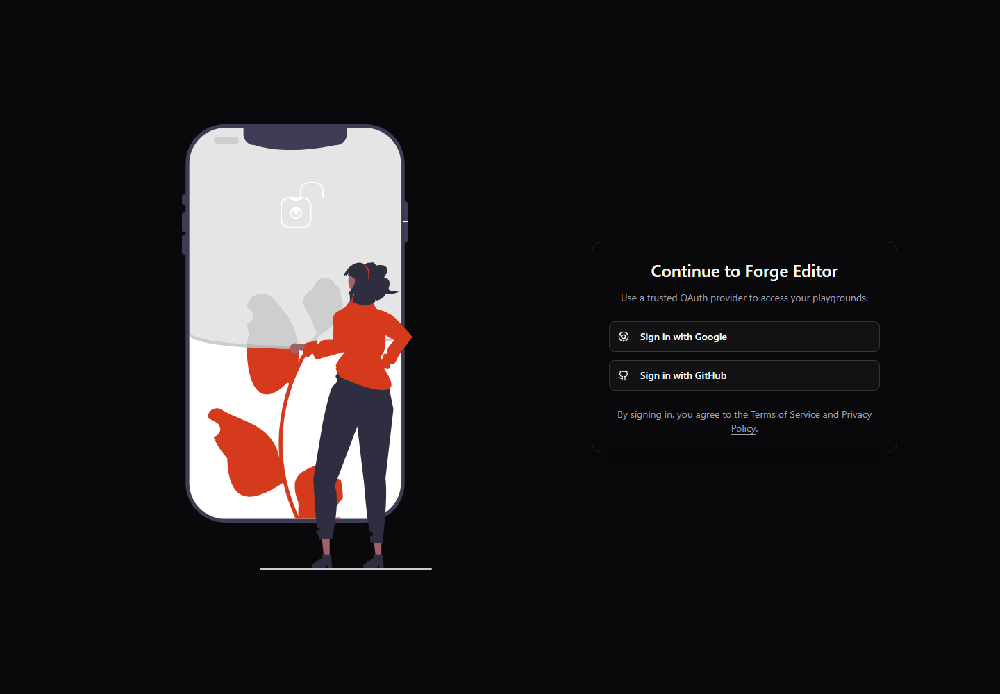
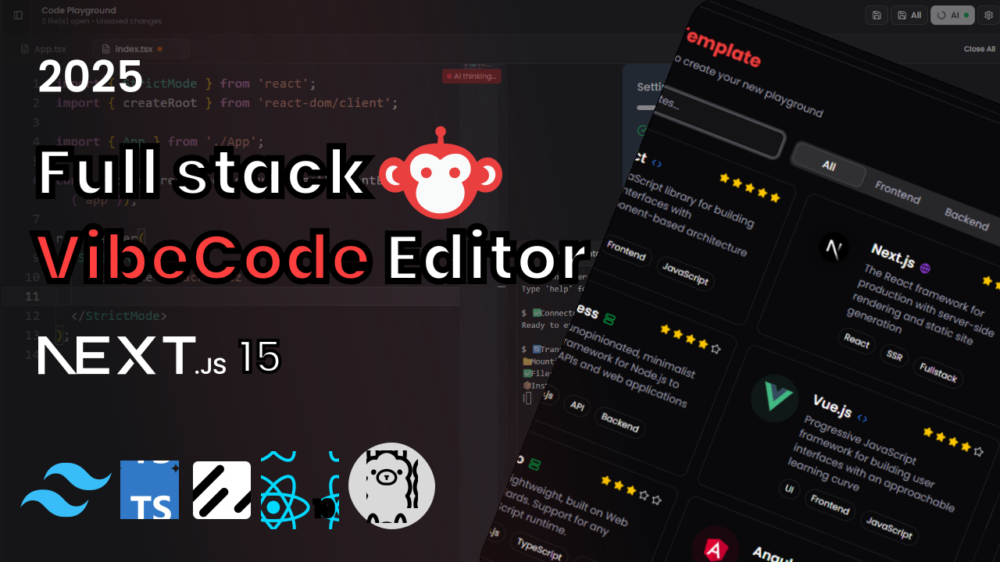
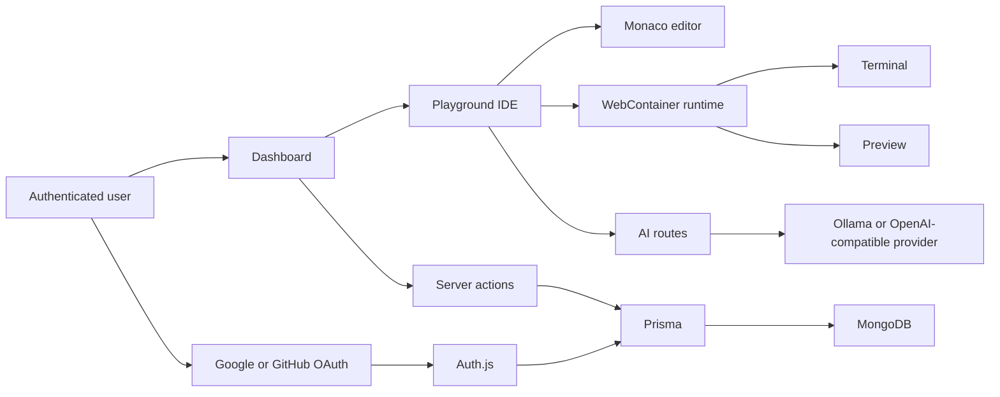

# Project Profile

Forge Editor is a full-stack browser IDE that combines authenticated playgrounds, project templates, Monaco editing, WebContainers, live preview, terminal execution, and reviewable AI assistance.

- Live: [https://aicodeeditor-sand.vercel.app](https://aicodeeditor-sand.vercel.app)
- Repository: [Rajtiwari0202/ai-code-editor](https://github.com/Rajtiwari0202/ai-code-editor)
- Stack: Next.js, TypeScript, Auth.js, Prisma, MongoDB, Monaco, WebContainers, xterm.js, Tailwind CSS

## Portfolio Summary

Forge Editor is a production-deployed AI code editor built to feel like a real development workspace rather than a generated demo. It supports OAuth sign-in, database-backed playgrounds, starter templates, file persistence, browser-based runtime execution, terminal output, live previews, and a server-side AI provider layer.

The project focuses on developer control. AI suggestions are surfaced through explicit chat and completion routes, while planning, patch, and verification APIs are structured for future reviewable workflows instead of silent file mutation.

## Problem

Most browser IDE demos stop at a static editor or a shallow AI prompt box. Forge Editor takes the harder path: it persists real users and projects, loads runnable templates, boots an in-browser runtime, keeps terminal and preview state visible, and protects production secrets behind server routes.

## Solution

Forge Editor provides a full product path:

1. Sign in with Google or GitHub.
2. Create a playground from a starter template.
3. Edit project files in Monaco.
4. Run commands in a WebContainer terminal.
5. Preview the app in the browser.
6. Ask the AI assistant for coding help.
7. Save work and return later.

## Screenshots

| Product page | Sign-in |
| --- | --- |
|  |  |

| Workspace preview |
| --- |
|  |

## Technical Highlights

- Built a Next.js App Router product with public, authenticated, API, and dynamic IDE routes.
- Implemented Auth.js OAuth with GitHub and Google, including verified Google email account linking.
- Modeled users, OAuth accounts, playgrounds, favorites, saved template files, and chat messages in Prisma.
- Added owner-scoped dashboard and playground mutations so users can only access their own projects.
- Integrated Monaco Editor with file tabs, explorer operations, and inline AI completion hooks.
- Integrated WebContainers and xterm.js for browser-contained runtime execution and terminal output.
- Added server-side AI provider abstraction for local Ollama and hosted OpenAI-compatible providers.
- Added production health checks, cross-origin isolation headers, environment validation, smoke tests, CI, CodeQL, and Dependabot.

## Architecture Snapshot

## Deployment Story

The app is deployed on Vercel with a MongoDB production database, Google and GitHub OAuth callbacks, a public health endpoint, and production response headers for WebContainer compatibility.

The deployment process is backed by:

- `npm run verify:release`
- Environment validation and strict production checks
- Documentation link validation
- Starter template validation
- Production dependency audit
- ESLint and production build
- Production smoke tests
- GitHub Actions CI
- CodeQL security scanning

## Resume Bullets

- Built and deployed Forge Editor, a full-stack browser IDE with Next.js, TypeScript, Auth.js, Prisma, MongoDB, Monaco Editor, WebContainers, xterm.js, and server-side AI routes.
- Implemented OAuth authentication, owner-scoped playground persistence, starter template loading, Monaco file editing, browser terminal execution, live preview, and AI chat/completion workflows.
- Added production release infrastructure with environment validation, template validation, docs validation, dependency audits, smoke tests, GitHub Actions CI, Dependabot, and CodeQL security scanning.
- Designed the AI layer around reviewable workflows using provider abstraction, request validation, provider-unavailable states, planning contracts, patch proposal contracts, and verification allowlists.

## Short Profile Copy

Forge Editor is a deployed AI code editor that gives developers an authenticated browser workspace with project templates, Monaco editing, WebContainer terminal execution, live preview, persisted files, and server-side AI assistance.

## Future Work

- Streaming AI chat responses.
- In-app model selection.
- Reviewable diff previews before applying AI patches.
- Verification command execution with captured output.
- More production screenshots of authenticated dashboard and playground workflows.
